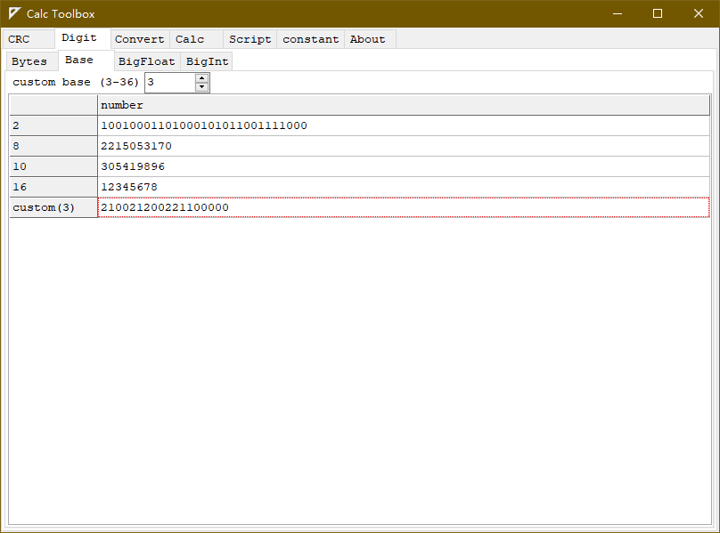

# CalcToolbox

A small cross platform calculation software for engineer calculation.

## Screenshot

  

Linux screenshot

  

## feature

- Multiple CRC calculations, with predefined patterns
  - CRC4
  - CRC5
  - CRC6
  - CRC7
  - CRC8
  - CRC16
  - CRC32
- Multiple base number conversion
- Multiple types of numbers to byte buffer conversion
- Big Float calculation
- Big Integer calculation
- Convertor
- Programmable calculator
- Multiple interpreters   
  - Pascal Script
  - micropython (windows/linux)
  - Lua
  - Tiny C
- Constants display
- more

## Some 3rd modules

- CRC algorithm from  
  https://www.iteye.com/blog/kiolp-2262455

- Base convert function from  
  https://blog.csdn.net/tianqin20140902/article/details/44151717

- Big Float and Big Integer (DFFLib) from  
  http://www.delphiforfun.org.ws034.alentus.com/Programs/Library/bigfloat.htm

- PascalScript (Integrate with Lazarus IDE)  
  https://wiki.lazarus.freepascal.org/index.php/Pascal_Script

- SynEdit (Integrate with Lazarus IDE)  
  https://wiki.freepascal.org/SynEdit

- RichMemo  
  https://wiki.freepascal.org/RichMemo

## Build

- Install Lazarus 2.0+ and FPC 3.0.4+
- Install RichMemo package
- Run Lazarus IDE, then open project **CalcToolBox.lpr**
- Build the project.

### Reduce file size

Default build binary file size is very large (> 30M), to reduce file size, please open project option dialog.
- in **Debugging** tab, remove option
  - **Generate info for the debugger**
  - **Display line numbers in run-time error backtraces**
- in Compilation and Linking, select
  - **Smart linkable**
  - **Link smart**

Then rebuild.

## More screenshot

- CRC

- Base convert

- Big Float calculate

- Big Int calculate

- Big Int calculate

- Programmable calculator

- Pascal interpreter

- micropython interpreter

- Lua interpreter

- TinyC interpreter

- Options

